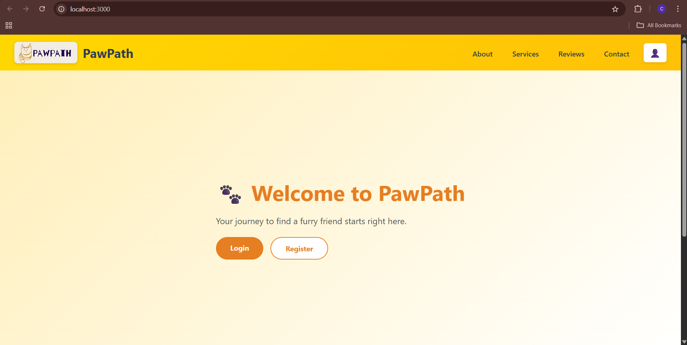
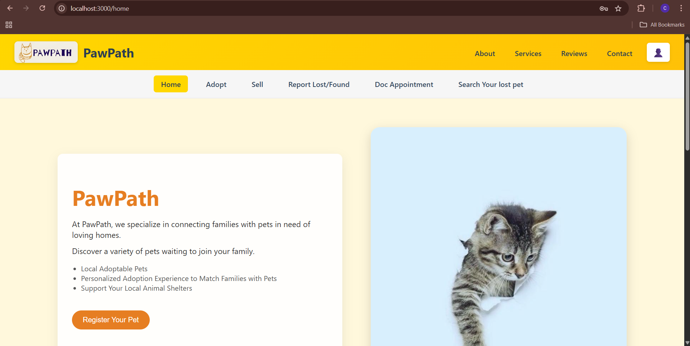
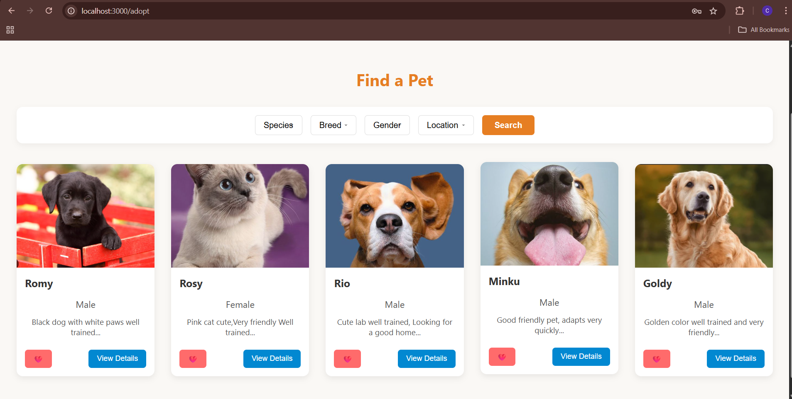
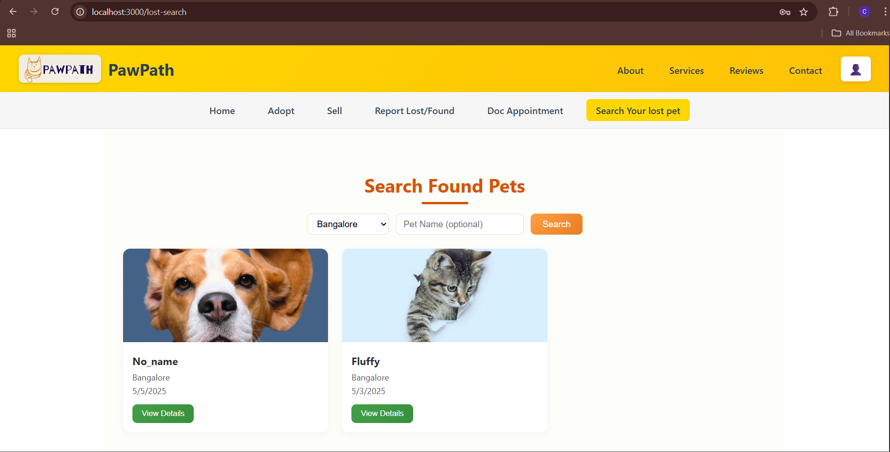
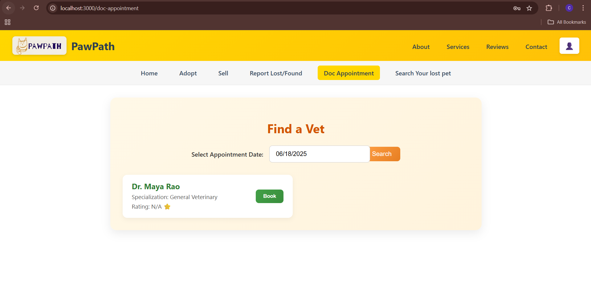
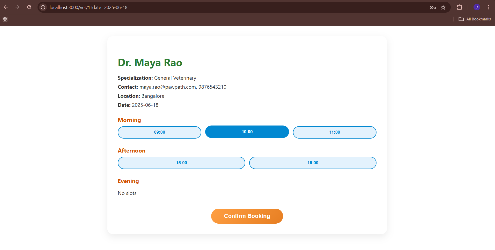
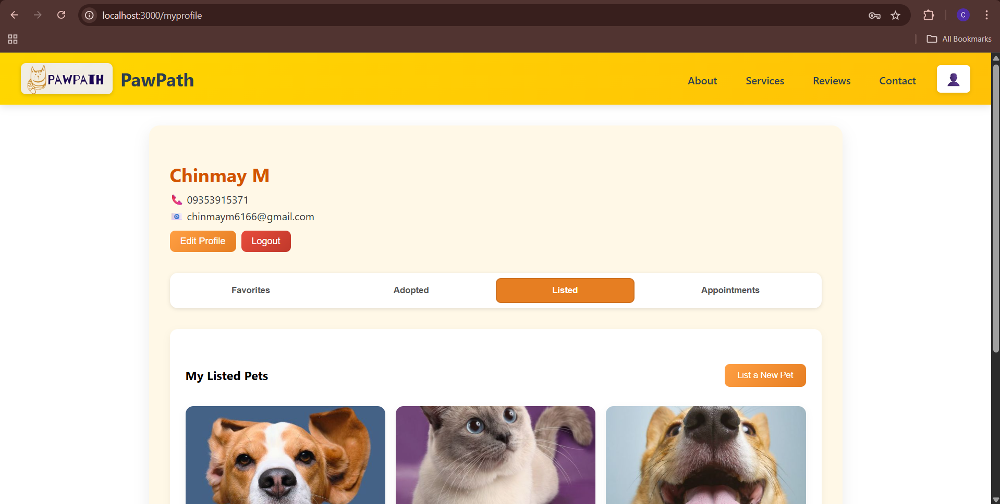
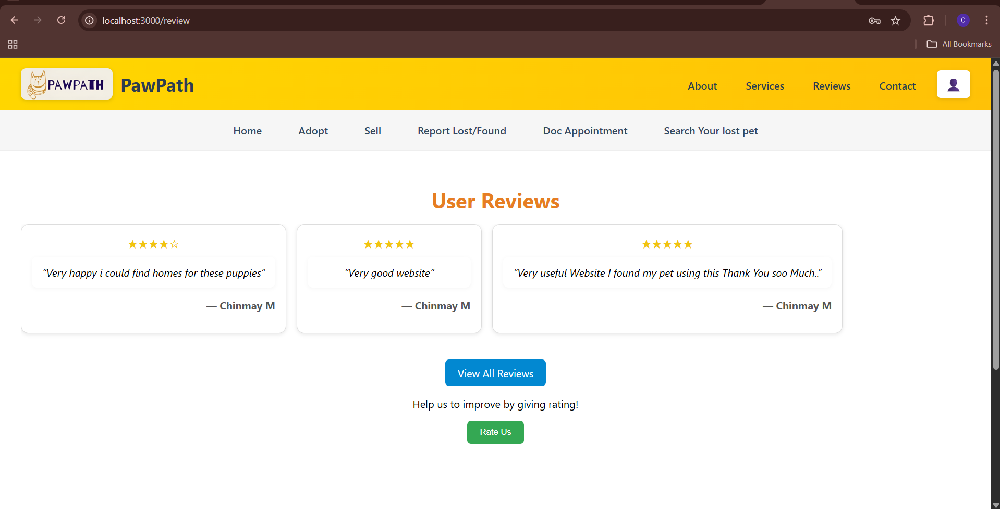

# 🐾 PawPath

**PawPath** is a full-stack community-driven web application built for pet lovers, shelters, and rescuers. It enables users to adopt pets, report lost & found animals, book vet appointments, and engage in community reviews and discussions. The goal is to provide a centralized hub for animal welfare services and connect people with trustworthy local resources.

---

## 🚀 Features

- 🔐 Secure User Authentication (JWT-based)
- 🐶 Pet Listings for Adoption (Add, View, Search)
- 📍 Lost & Found Pet Reporting with Location Search
- 🏥 Vet Clinic and Doctor Appointment Booking
- 🧑‍⚕️ Verified Vet and Shelter Listings
- 💬 Review & Feedback System
- 📩 In-App Messaging and Profile Management
- 📥 RESTful Backend API using Express.js
- ⚛️ Responsive UI with React

---

## 🛠️ Tech Stack


### Frontend:
- React
- React Router
- Axios
- Context API (Auth & Global State)

### Backend:
- Node.js
- Express.js
- JWT Authentication
- Bcrypt Password Hashing
- CORS, Helmet

### Database:
- PostgreSQL
- Structured schemas with relationships
- Tables: Users, Pets, Reports, Reviews, Vets, Appointments, Messages

---

## 🧰 Getting Started

### 🔹 Clone the Repository

```bash
git clone https://github.com/Chinmaym6/PawPath.git
cd PawPath
```

### 🔹 Set Up the Backend

```bash
cd server
npm install
```

Create a .env file in the backend directory:

```bash
PORT=5000
JWT_SECRET=your_jwt_secret
DB_HOST=localhost
DB_PORT=5432
DB_USER=postgres
DB_PASSWORD=your_password
DB_NAME=pawpath
```

Start the backend server:
```bash
node index.js
```

### 🔹 Set Up the Frontend
```bash
cd frontend
npm install
npm start
```

###🔹 Visit the App

Open your browser and go to:
```bash
http://localhost:3000
```

### 📊 Landing


### 📊 Home


### 📊 Adopt Pet


### 📊 Search lost pet


### 📊 Vet Appointment


### 📊 Book Vet


### 📊 My Profile 


### 📊 Reviews

